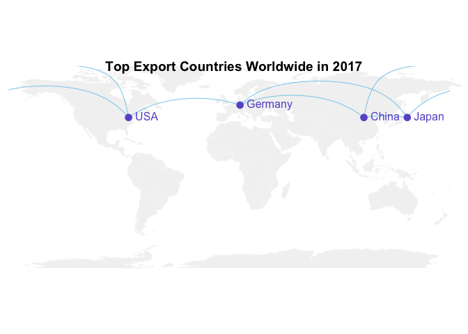

GDP
================
Quinn Keck
5/12/2019

``` r
gdp_long <- read_csv("world_bank_gdp_long_1977_2017.csv")
gdp_long <- drop_na(gdp_long)
head(gdp_long)
```

    ## # A tibble: 6 x 4
    ##      X1  Year Country                        GPD
    ##   <int> <int> <chr>                        <dbl>
    ## 1     0  2017 Aruba                  2700558659.
    ## 2     1  2017 Afghanistan           19543976895.
    ## 3     2  2017 Angola               122123822334.
    ## 4     3  2017 Albania               13038538300.
    ## 5     4  2017 Andorra                3012914131.
    ## 6     5  2017 United Arab Emirates 382575085092.

``` r
gdp_long$Year <- as.character(gdp_long$Year)

top_gdp <- gdp_long  %>%
  group_by(Year) %>%
  top_n(2, GPD)

gdpMeans <- gdp_long %>% 
              group_by(Year) %>% 
                summarize(meanVals = mean(GPD))
g <- gdp_long %>% 
  ggplot() +
  geom_boxplot(aes(x = Year, y = gdp_long$GPD, group = Year), alpha = 0.5, colour = "green4") +
  geom_point(data = gdpMeans, aes(x = Year, y = meanVals), size = 5, shape = 10, colour = "blue", alpha = 0.7) + 
  xlab("\nYear") +
  geom_label(data = top_gdp, aes(x = Year, y = GPD, label = Country), colour = "blue", size = 2, fontface = "bold", alpha = 0.3) +
  ylab("Gross Domestic Product\n") +
  ggtitle("Distribution of GPDs in Last Five Decades") 

g
```


``` r
ggsave("boxplot_withoutliers.png")
```

``` r
gdpMeans <- gdp_long %>% 
              group_by(Year) %>% 
                summarize(meanVals = mean(GPD))

gdp_filter <- gdp_long %>% 
  filter(GPD <= 2.0e+12)

gz <- gdp_filter %>%
  ggplot() +
  geom_boxplot(aes(x = gdp_filter$Year, y = gdp_filter$GPD, group = gdp_filter$Year), alpha = 0.5, colour = "green4") +
  geom_point(data = gdpMeans, aes(x = Year, y = meanVals), size = 5, shape = 10, colour = "blue", alpha = 0.7) + 
  xlab("\nYear") +
  ylab("Gross Domestic Product\n") +
  ggtitle("Distribution of GPDs in Last Five Decades Zoomed",  subtitle = "GDP Under 2e+12") 

gz
```


``` r
gdp_filter <- gdp_long %>% 
  filter(GPD <= 9.0e+10)

gz <- gdp_filter %>% 
  ggplot() +
  geom_boxplot(aes(x = gdp_filter$Year, y = GPD, group = gdp_filter$Year), alpha = 0.5, colour = "green4") +
  xlab("\nYear") +
  ylab("Gross Domestic Product\n") +
  ggtitle("Distribution of GPDs in Last Five Decades Zoomed", subtitle = "GDP Under 9.0e+10") 

gz
```


``` r
ggsave("boxplot_zoom.png")
```

Connection Map
==============

``` r
#gdp_long <- read_csv("world_bank_gdp_long_1977_2017.csv")
top10_gpd_2017 <- gdp_long  %>%
  filter(Year=='2017') %>%
  top_n(10, GPD)
 
arrange(select(top10_gpd_2017, Country, GPD), desc(GPD))
```

    ## # A tibble: 10 x 2
    ##    Country            GPD
    ##    <chr>            <dbl>
    ##  1 United States  1.95e13
    ##  2 China          1.22e13
    ##  3 Japan          4.87e12
    ##  4 Germany        3.69e12
    ##  5 India          2.65e12
    ##  6 United Kingdom 2.64e12
    ##  7 France         2.58e12
    ##  8 Brazil         2.05e12
    ##  9 Italy          1.94e12
    ## 10 Canada         1.65e12

``` r
# https://www.r-graph-gallery.com/how-to-draw-connecting-routes-on-map-with-r-and-great-circles/

plot_my_connection=function( dep_lon, dep_lat, arr_lon, arr_lat, ...){
    inter <- gcIntermediate(c(dep_lon, dep_lat), c(arr_lon, arr_lat), n=50, addStartEnd=TRUE, breakAtDateLine=F)             
    inter=data.frame(inter)
    diff_of_lon=abs(dep_lon) + abs(arr_lon)
    if(diff_of_lon > 180){
        lines(subset(inter, lon>=0), ...)
        lines(subset(inter, lon<0), ...)
    }else{
        lines(inter, ...)
        }
    }


par(mar=c(0,0,0,0))
m <- map('world',col="#f2f2f2", fill=TRUE, bg="white", lwd=0.05,mar=rep(0,4),border=0, ylim=c(-80,80))
LA <- c(-118.40, 33.95)
NY <- c(-73.78, 40.63)
USA <- c(-80, 40)
India <- c(80, 20)
Brazil <- c(-60, -5)
China <- c(110, 40)
Japan <- c(145, 40)
Germany <- c(10, 50)
data=rbind(USA, China, Japan, Germany) %>% as.data.frame()
colnames(data)=c("long","lat")

all_pairs=cbind(t(combn(data$long, 2)), t(combn(data$lat, 2))) %>% as.data.frame()
colnames(all_pairs)=c("long1","long2","lat1","lat2")

for(i in 1:nrow(all_pairs)){
    plot_my_connection(all_pairs$long1[i], all_pairs$lat1[i], all_pairs$long2[i], all_pairs$lat2[i], col="skyblue", lwd=1)
    }
 
points(x=data$long, y=data$lat, col="slateblue", cex=2, pch=20)
text(rownames(data), x=data$long, y=data$lat,  col="slateblue", cex=1, pos=4)
title( main = "Top Export Countries Worldwide in 2017")
```



``` r
ggsave("connection_map.png")
```

Trade Data Sources: <https://www.statista.com/statistics/272862/leading-trade-routes-worldwide-in-2030-by-trading-value/> <https://www.eulerhermes.com/en_global/media-news/news/Press-Release-EH-Trade-Report-12032018-final.html> <https://www.statista.com/statistics/264623/leading-export-countries-worldwide/>

``` r
countries <- read_csv("country_rows_df.csv")
countries <- drop_na(countries)

ggplot(countries, aes(x=countries$`Country credit rating, 0–100 (best)*`)) + 
 geom_histogram(aes(y=..density..), colour="black", fill="white", bins = 100)+
 geom_density(alpha=.2, fill="green4") +
  xlab("Country credit rating, 0–100") +
  ylab("") +
  ggtitle("Distribution of Country Credit Scores in 2018") 
```


