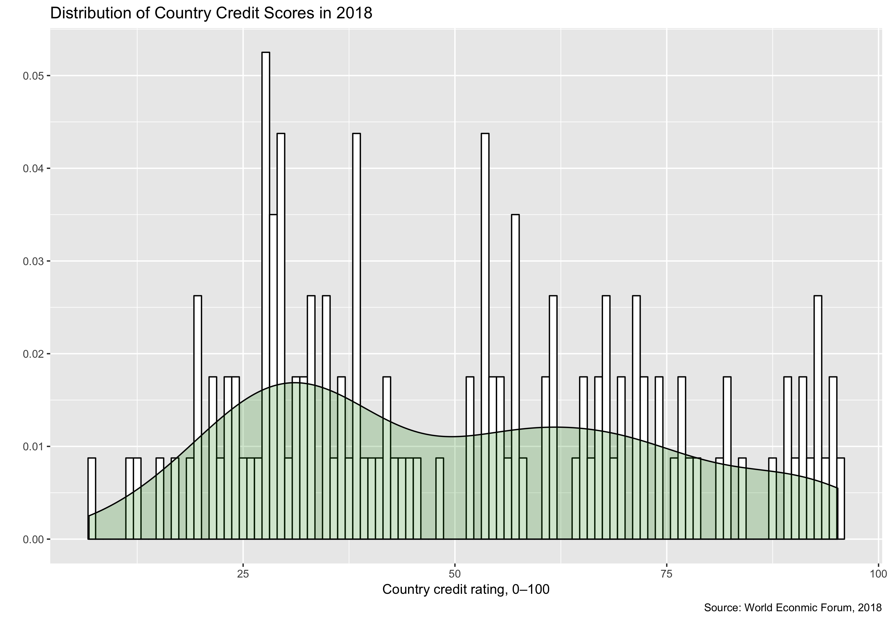
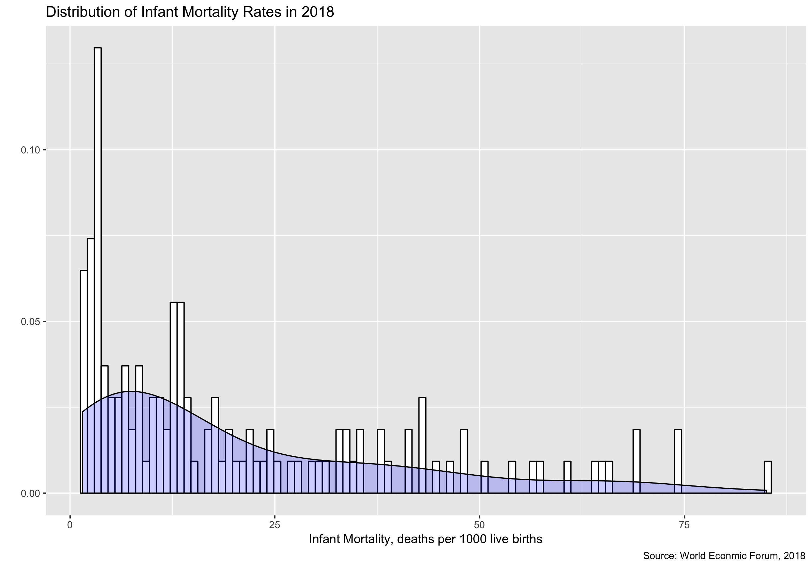
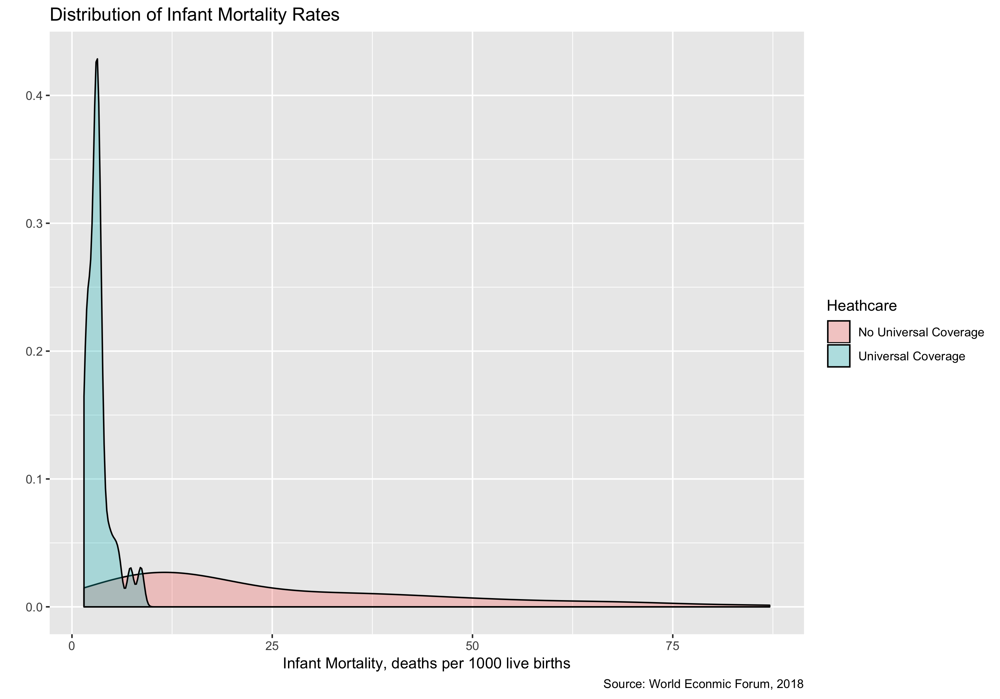
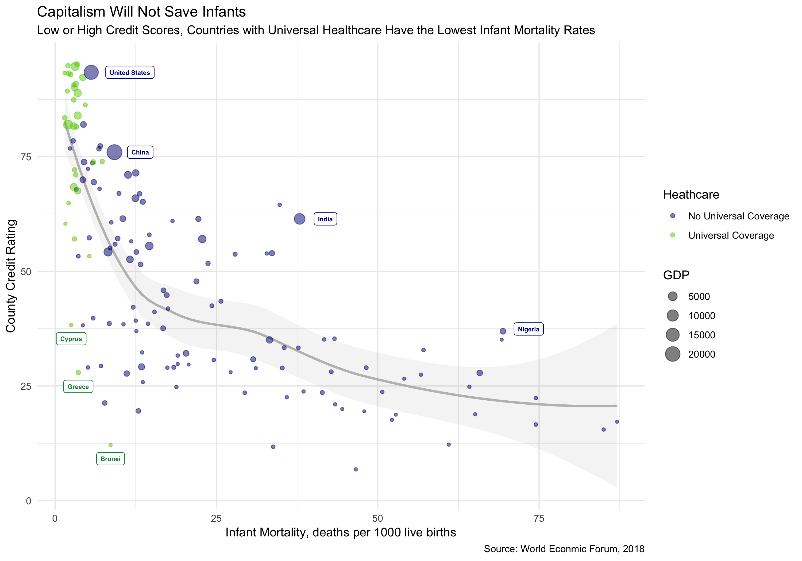

Global Metrics of Economic Prosperity and Health
================
Quinn Keck
5/15/2019

Introduction
============

The Global Competitiveness Score dataset from the World Economic Forum compares a variety of metrics from economics to healthcare indicators. One such metric is a credit rating for each country that on a scale of 0 to 100 is computed as an average of Fitch, Standards and Poor’s (S&P) and Moody’s credit ratings. The following graphs explore how country’s economies affect infant mortality by looking at the distributions of these outcomes and then their correlations. While it would be expected that wealth is generally correlated with lower infant mortality rates, the outliers are of particular interest.

Distribution of Credit Scores and Infant Mortality Rates
========================================================

``` r
countries <- read_csv("country_rows_df.csv")
countries <- drop_na(countries)

ggplot(countries, aes(x = countries$`Country credit rating, 0–100 (best)*`)) + 
    geom_histogram(aes(y = ..density..), colour = "black", fill = "white", 
        bins = 100) + geom_density(alpha = 0.2, fill = "green4") + 
    labs(title = "Distribution of Country Credit Scores in 2018", 
        x = "Country credit rating, 0–100", y = "", caption = "Source: World Econmic Forum, 2018")
```



``` r
ggplot(countries, aes(x = countries$`Infant mortality, deaths/1,000 live births*`)) + 
    geom_histogram(aes(y = ..density..), colour = "black", fill = "white", 
        bins = 100) + geom_density(alpha = 0.2, fill = "blue") + 
    labs(title = "Distribution of Infant Mortality Rates in 2018", 
        x = "Infant Mortality, deaths per 1000 live births", 
        y = "", caption = "Source: World Econmic Forum, 2018")
```



``` r
healthcare <- read_csv("health_unviersal_rename_cols.csv")

ggplot(healthcare, aes(x = Infant_Mortality, fill = Heathcare)) + 
    geom_density(alpha = 0.3) + labs(title = "Distribution of Infant Mortality Rates", 
    x = "Infant Mortality, deaths per 1000 live births", y = "", 
    caption = "Source: World Econmic Forum, 2018") + theme_gray()
```



Conclusion
==========

``` r
# Labels

bottom_credits <- healthcare %>%
  filter(Heathcare == "Universal Coverage" & Credit_Rating <= 50) 

bottom_credits$Credit_Rating_Minus_3 <- bottom_credits$Credit_Rating - 3

USA <- healthcare %>%
  filter(Name =='United States')

USA$Position <- USA$Infant_Mortality + 6

India <- healthcare %>%
  filter(Name =='India')

India$Position <- India$Infant_Mortality + 4

China <- healthcare %>%
  filter(Name =='China')

China$Position <- China$Infant_Mortality + 4

Nigeria <- healthcare %>%
  filter(Name =='Nigeria')

Nigeria$Position <- Nigeria$Infant_Mortality + 4

Nigeria$Credit_Rating_Plus_One <- Nigeria$Credit_Rating + 0.5

# Plot 

healthcare %>%
  ggplot() +
  stat_smooth(aes(x=Infant_Mortality, y=Credit_Rating),method = "loess", col = "gray", alpha =0.1) +
  scale_color_manual(values=c("navyblue", "chartreuse3")) +
  geom_label(data = bottom_credits, aes(x=Infant_Mortality, y=Credit_Rating_Minus_3, label = Name), colour = "springgreen4", size = 2, fontface = "bold", alpha = 0.9) +# se=FALSE 
  geom_label(data = USA, aes(x=Position, y=Credit_Rating, label = Name), colour = "darkblue", size = 2, fontface = "bold", alpha = 0.9) + 
  geom_label(data = China, aes(x=Position, y=Credit_Rating, label = Name), colour = "darkblue", size = 2, fontface = "bold", alpha = 0.9) +
  geom_label(data = India, aes(x=Position, y=Credit_Rating, label = Name), colour = "darkblue", size = 2, fontface = "bold", alpha = 0.9) +
  geom_label(data = Nigeria, aes(x=Position, y=Credit_Rating_Plus_One, label = Name), colour = "darkblue", size = 2, fontface = "bold", alpha = 0.9) +
  geom_point(aes(x=Infant_Mortality, y=Credit_Rating, colour = Heathcare, size=GDP), alpha=0.5) +
   labs(title = "Capitalism Will Not Save Infants",
       subtitle = "Low or High Credit Scores, Countries with Universal Healthcare Have the Lowest Infant Mortality Rates",
       x = "Infant Mortality, deaths per 1000 live births", y = "County Credit Rating",
       caption = "Source: World Econmic Forum, 2018") +
  theme(plot.caption = element_text(hjust = 0)) + theme_minimal()
```



Countries with universal healthcare have significantly lower infant mortality rates then countries with similar economic metrics but without universal healthcare. Several countries with large GDP’s, like China, India, and Nigeria, have high infant mortality rates compared to countries with similar credit scores. However, Cyprus and Greece, despite having credit scores and GDP’s that are mere fractions of the United States, have lower infant mortality rates. Even Brunei, which has a slightly higher infant mortality rate than the United States, still has among the lowest global infant mortality rates even though it has the second lowest credit score in the world and a very small GDP.

If these countries with significantly less economic resources can be competitive with countries like the United States in terms of infant mortality, there is a clear need to change the United States’ healthcare system so that fewer infants to die in the United States. A free market, high credit score, and large GDP cannot be relied on, in and of themselves, to protect infants from early deaths and provide equitable healthcare for all.

Data Sources
============

Global Competitive Index Dataset –

<http://reports.weforum.org/global-competitiveness-report-2018/downloads/> (includes GDP, Infant Mortality, and Credit Rating)

Country’s Universal Health Care (Joined with Global Competitive Index Data) –

<https://truecostblog.com/2009/08/09/countries-with-universal-healthcare-by-date/> \*\*
